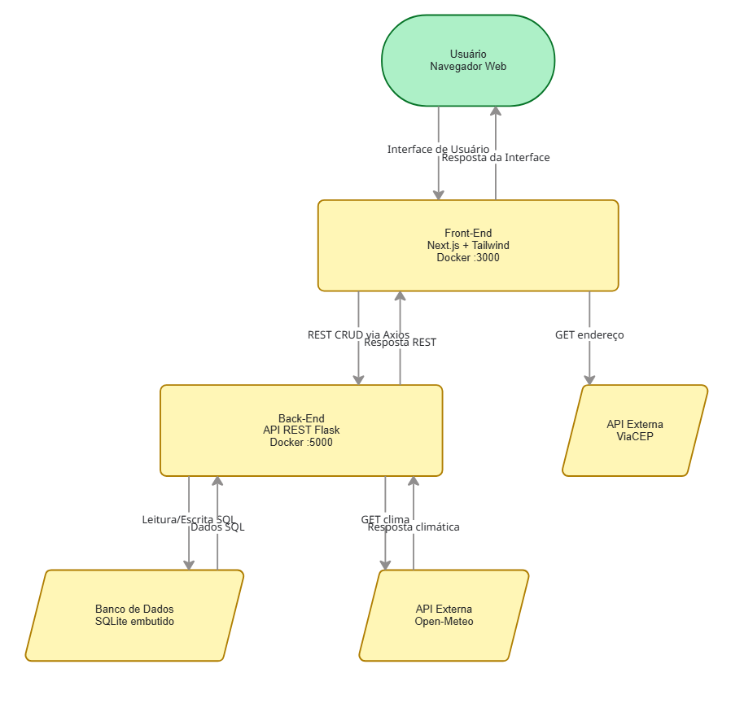

# Offshore Logistics Dashboard (Front-End) - MVP4

Interface interativa conteinerizada desenvolvida para o MVP de Arquitetura de Software (Cenário 1.1). Consome a API local em Flask e integra-se diretamente com o ViaCEP para autopreenchimento de endereços.

## Tecnologias Utilizadas
* **Framework:** Next.js 14 (App Router)
* **Linguagem:** TypeScript
* **Estilização:** Tailwind CSS
* **Requisições:** Axios
* **Integração Externa:** ViaCEP API
* **Deploy:** Docker

## APIs Externas Utilizadas
Conforme os requisitos, o projeto consome serviços públicos e gratuitos:
1. **ViaCEP**: Utilizada para preenchimento automático de endereço no Front-End através da rota `GET https://viacep.com.br/ws/{cep}/json/`. Não exige autenticação ou licença restrita.
2. **Open-Meteo**: Utilizada pelo Back-End para buscar dados climáticos offshore através da rota `GET https://api.open-meteo.com/v1/forecast`. Serviço gratuito e de código aberto, sem necessidade de cadastro de chave (API Key).

## Como Executar (Docker)
1. Construa a imagem do Front-End:
   `docker build -t offshore-frontend .`
2. Execute o container na porta 3000:
   `docker run -p 3000:3000 offshore-frontend`

Acesse `http://localhost:3000` no seu navegador para utilizar o sistema.

